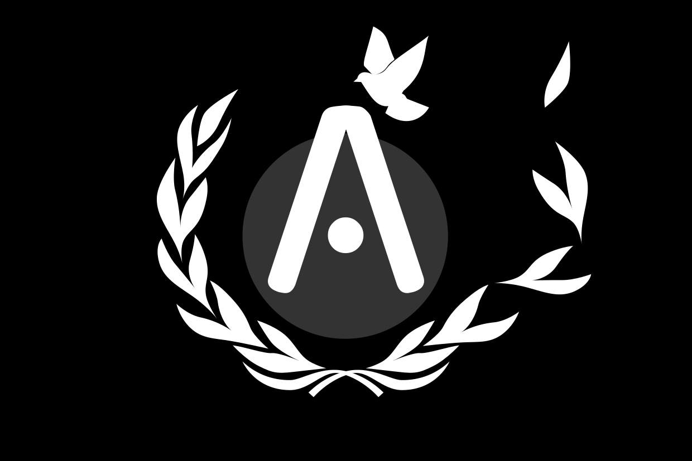

## Aesir

Aesir est une petite corporation fortement militarisée, issue d’une scission avec Vranberg-Lytan. Fondée par Marth « Iron Lady », l’IA conçue pour gagner la guerre des colonies, la corporation s’est fixé le but de « résoudre le problème terrien »

>> ### Aesir
>>
>> * **Forme** : Dictature militaire
>> * **Leaders** : Marth « Iron Lady » (Leader)
>> * **Modèle** : Économie virtuelle et militariste basé sur un réseau social
>> * **Capitale** : Neo-Leanor (Callisto), à partir de mi-2237
>> * **Fondation** : 2235
>> * **Puissance** : Moyenne puissance

Au lendemain de la guerre, Vranberg-Lytan qui s’était fortement militarisé décide revenir à un fonctionnement civil et le conseil veut démanteler son imposante armée qu’il juge caduque. Cette décision ne plaît pas à de nombreux militaire et Marth, dont les décisions ont fait pencher le cours de la guerre, fait campagne pour conserver une force suffisante au cas où une nouvelle menace émergerait. Elle s’appuie notamment sur plusieurs analyses qui indiquent que la situation de la Terre s’est fortement dégradée et que les politiques anti-colonies ont de grandes chances de mener à une nouvelle guerre.

Le conseil refuse d’écouter ses opposants et signe l’acte de démilitarisation de la colonie. Dans la journée, Marth annonce qu’elle quitte la corporation, suivie d’une partie de l’état-major. Plusieurs colonies font sécession et de nombreux vaisseaux désertent. Alors que le conseil dénonce une trahison et tente de faire appel aux autres corporations, Marth annonce la fondation d’Aesir, une nouvelle corporation à laquelle toutes les cités sécessionnistes ainsi que les déserteurs de Vranberg-Lytan se rattachent dans la journée. Le conseil de Vranberg-Lytan est impuissant et ne peut que constater qu’il a perdu le contrôle depuis bien plus longtemps qu’il ne l’imaginait.

Rapidement Marth, met en ordre la nouvelle corporation : ses efforts parviendront même à limiter la période de transition à seulement deux semaines. L’IA annonce alors officiellement l’objectif de la corporation : trouver une solution au problème terrien. Évidemment, cela déclenche la suspicion des autres corporations et la colère de l’ONU.

Construisant son réseau diplomatique, la corporation s’allie avec Mars et signe le traité des colonies pour mettre fin aux rumeurs bellicistes de la corporation. Elle s’engage même avec la planète rouge à établir une liaison diplomatique avec la Terre qui se concrétise par l’établissement d’une ambassade à la surface de la planète bleue.

Malgré tout, les autres corporations continuent de se méfier d’Aesir et de nombreux incidents provoqués par les plus fanatiques et anti-terrien de ses rangs confirment cette position. Par son message ambigu, Marth a malheureusement aussi invité des personnages tout aussi ambigus.
