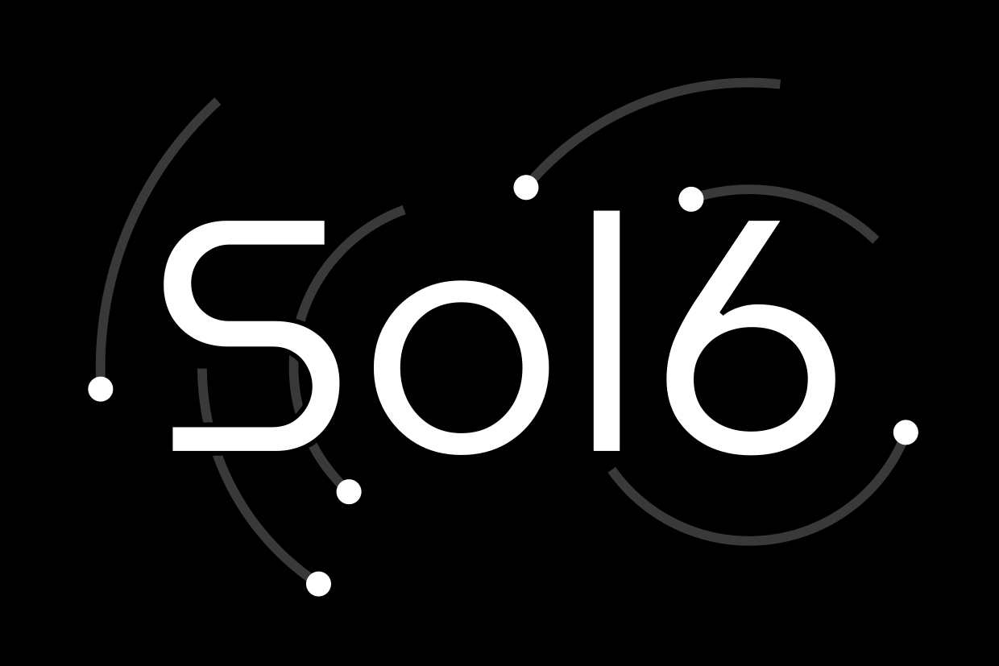

## Sol6

Sol6 est la seule corporation à posséder un appui sur Terre et à travailler avec l’ONU. Elle ne dispose pas d’armée et n’a pas signé le traité des Colonies : c’est encore une corporation selon l’ancien sens qui se contente d’extraire des ressources de Mercure et d'astéroïdes pour approvisionner ses installations orbitales et lunaires.

>> ### Sol6
>>
>> * **Type** : Société privée
>> * **Siège** : Kampala (Ouganda, Terre)
>> * **Fondation** : 2186
>> * **Puissance** : Petite puissance

Première corporation de la seconde vague, Sol6 lance rapidement son propre programme spatial. Très intéressée par la Lune, elle y installe bien plus de colonies que les autres corporations qui semblent n’y voir qu’une rampe de lancement. Sol6 se focalise ensuite sur l’extraction minière des astéroïdes et vise Cérès et Mercure.

Son approche intéressée de la colonisation l’isolera vis-à-vis des autres corporations et si elle bénéficie notamment des publications de HIARTech, elle ne contribue finalement que peu au développement scientifique et technique en dehors de certains aspects liés aux environnements des systèmes les plus internes.

Visant des bénéfices à long terme, la corporation fait d’impressionnants efforts de communication auprès de ses actionnaires et lorsque le conflit éclate entre HIARTech et l’ONU, la corporation fait profil bas, se gardant bien de prendre un parti. Surtout qu’elle a d’autres problèmes par ailleurs.

En effet, le rythme et les cadences du personnel des colonies de Cérès et Mercure génèrent beaucoup de stress et les conditions de vie sur la planète mineure se dégradent sensiblement. Des révoltes éclatent et Sol6 peine à y rétablir l’ordre. Même une fois la situation résolue, ces colonies restent instables et n’attendent qu’une étincelle pour exploser.

Sur Terre, la situation politique en Ouganda est fortement perturbée par l’impact économique de la corporation et le pays fait face à des troubles et des problèmes de sécurités. Son siège situé à Kampala, la corporation se retrouve obligée de lever ses propres forces de sécurité. En définitif, Sol6 devient même la première force armée de l’ancienne colonie anglaise qui sombre dans une série de conflit interne.

Alors que Sol6 parvient enfin à assurer ses installations terrestres et que la situation dans ses colonies sur Cérès semble stabilisée, l’ONU entre en guerre ouverte avec HIARTech. Alors que les autres corporations s’allient en opposition aux nations unies, Sol6 tente une approche différente et tente de s’allier avec l’organisation mondiale. Ainsi, lorsque Vranberg-Lytan partage ses plans des premiers chasseurs spatiaux avec les corporations, Sol6 échange une copie de ceux-ci avec les nations unies contre des garanties concernant ses propres installations. Lorsque les corporations s’indignent des actions de l’ONU après l’attentat sur Mars, Sol6 s’alignent sur son allié et nie la validité des preuves avancées par les Solar Wardners. Lorsque l’ONU lance son ultimatum la corporation s’est déjà mise en conformité et accepte sa « réintégration » dans ce système politique qu’elle n’a pas quitté. Et quand la guerre des colonies éclate, c’est la Terre et l’ONU qu’elle soutient en fournissant une grande part de la chaîne logistique.

Ces diverses actions lui valent évidemment le courroux des autres corporations. Durant la seconde moitié de la guerre, Mars s’en prend à ses convois et certaines de ses installations sur Mercure à travers de nombreuses opérations sous couverture. Lors de la signature du traité des colonies, Sol6 n’est pas conviée, reléguée par ses pairs à une « vulgaire » entreprise terrestre. La guerre des colonies lui a aussi définitivement coûté ses colonies sur Cérès qui ont fait sécession et Sol6 ne songe même plus les récupérer.

Jusqu’ici Sol6 ne s’est jamais vraiment opposée aux rapports de forces et si son attitude peut lui donner une aura de couardise, force est de constater que toutes les corporations ont perdu bien plus qu’elle au cours de l’Histoire. Malgré tout, face à Mars ou Suan, la corporation reste relativement petite. Pour couronner le tout, étant un protectorat de l’ONU, Sol6 ne dispose plus de force militaire propre.
