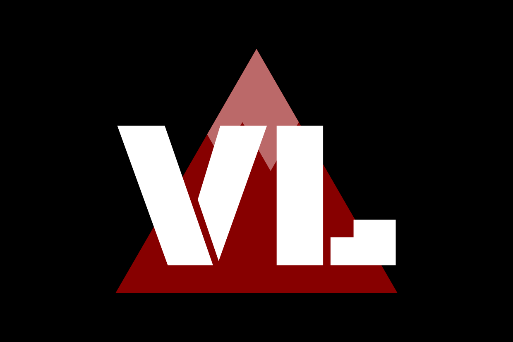

# Vranberg-Lytan

Vranberg-Lytan est l’une des corporations externes et possède de nombreuses colonies dans le système jovien et le système saturnien. Elle a longtemps eu une vision intéressée de la colonisation et occupe principalement des sites riches en ressources.

>> ### Vranberg-Lytan
>>
>> * **Forme** : Dictature militaire
>> * **Leaders** : Conseil composé des amiraux et généraux
>> * **Modèle** : Économie virtuelle et militariste basé sur un calcul félicifique
>> * **Capitale** : Danel (Ganymède)
>> * **Fondation** : 2185
>> * **Puissance** : Moyenne puissance

Seconde corporation à s’être formée, en 2185, Vranberg-Lytan marche initialement dans les pas de HIARTech. Proposé à l’origine comme un objectif de prestige, Vranberg-Lytan vise le système jovien. Le succès des missions vers Mars indique très clairement la viabilité et la maturité des technologies de colonisation et le conseil de direction est persuadé qu’une civilisation spatiale est sur le point d’émerger. Or, Vranberg-Lytan veut faire partie des premiers, car ils auront un avantage indéniable.

Rapidement, la corporation achète le moteur d’IA Synchro et se lance dans une politique industrielle massive. La reconsolidation terminée, Vranberg-Lytan lance son programme spatial et se rapproche de la première corporation pour tenter de rattraper son retard. C’est une bonne chose car HIARTech décide de louer, à un tarif raisonnable, son chantier spatial aux autres corporations et Vranberg-Lytan en profite immédiatement.

Durant le début de la colonisation, Vranberg-Lytan met en place un processus de colonisation en deux temps : la première phase consiste à installer l’infrastructure nécessaire pour la survie de son personnel et la seconde s’emploiera à développer une industrie locale forte.

Vranberg-Lytan revoit légèrement sa stratégie lorsque l’ONU balaie HIARTech de la Terre, à ce moment-là, la corporation réalise deux choses : ses positions sur Terre sont menacées et il lui faut une force militaire spatiale pour défendre ses colonies. La corporation commence alors son grand exode et commence à rapatrier ses installations de recherche et de développement. Elle développe dans l’urgence les premiers chasseurs spatiaux. Dans les années qui suivent, la corporation sera systématiquement à l’avant-garde de la stratégie militaire spatiale.

Souhaitant renforcer les colonies et sa position parmi elles, Vranberg-Lytan partage les documents de conception et d’utilisation de ses chasseurs avec les autres corporations. Le refus de Sol6 entraîne la suspicion de la corporation. Lorsque l’ONU annonce avoir produit son premier croiseur et ses premiers chasseurs, Vranberg-Lytan constate qu’en réalité Sol6 l’a même trahie. À partir de ce jour, Vranberg-Lytan commence une campagne diplomatique contre Sol6.

Lors de l’attaque sur le conseil directoire martien, Vranberg-Lytan se retrouve dans la ligne de mire de l’investigation. Consciente qu’il s’agit très certainement d’une manœuvre de l’ONU, la corporation se rapproche de Mars et laisse le corps nouvellement formé des Solar Wardners accéder à ses documents. Une fois la preuve de la culpabilité de l’ONU apportée, Vranberg-Lytan est la première corporation à adopter une posture particulièrement hostile et agressive envers les nations unies.

La guerre des colonies arrive finalement et comme prévu, l’ONU lance l’assaut sur les installations terrestres. La corporation finalise alors le grand exode commencé plusieurs années avant. Lorsque la guerre atteint Jupiter, Vranberg-Lytan se lance dans la guerre à bras le corps. La guerre est beaucoup plus difficile que prévu : l’ONU dispose de l’industrie terrienne et peut se permettre de bien plus lourdes pertes que les corporations.

À la destruction de Leanor, le conseil militaire de la corporation décide de lancer le projet Marth, remplaçant son état-major par une nouvelle IA militaire sentiente. Cette nouvelle stratégie inquiète initialement les alliés de la corporation, mais Marth dissipe tout doute dès ses premières batailles. Coordonnant les flottes alliées, l’IA emploie des stratégies atypiques et novatrices. Les premiers temps, l’ONU encaisse, fort de ses effectifs. Mais au fil des batailles, les corporations commencent à l’emporter et finissent par envoyer leurs forces vers la Terre pour mettre fin à la guerre.

Curieusement, Vranberg-Lytan reste en retrait lors des échanges diplomatiques : la machine de guerre a englouti toute l’administration de la corporation et Marth préfère laisser les diplomates alliés gérer cette dernière bataille. Toutefois pour donner plus de poids aux corporations lors des négociations, Vranberg-Lytan s’est associé avec Suan pour préparer au déploiement de plus d’une centaine de bombes à fusion et s’en servir comme une menace. La stratégie paie et la reddition de la Terre est intégrale. Mars apporte un traité qui met la Terre de côté et les corporations retournent dans leurs colonies.

Vient enfin le grand remaniement de la corporation. Avec la fin de la guerre, le conseil de Vranberg-Lytan décide de revenir à un mode de fonctionnement civil. Le conflit a en effet assujetti la corporation à sa branche militaire. La Terre ne représentant plus une menace tant elle est dépassée technologiquement, il n’est plus utile de maintenir une flotte et une armée aussi importante.

Sous l’impulsion de Marth, une dissension interne prend pied : l’IA et un grand nombre de ses sympathisants souhaitent que la corporation reste forte militairement et prête pour le jour où la Terre rompra le traité des colonies. Le désaccord ne parvient pas à se résoudre et plusieurs colonies font sécession et se regroupent pour former Aesir, sous le commandement de Marth.

Le choc ébranle l’administration de Vrangerg-Lytan et les partisans de l’extension de la colonisation quittent eux aussi la corporation pour former Urania. Alors que la corporation sombre dans le chaos, l’état-major de Vranberg-Lytan décide de reprendre le pouvoir et rétablit l’ordre. Le conseil civil est alors remis au second plan et accablé des deux scissions.

Paradoxalement, alors que la corporation a perdu les membres d’Aesir parce qu’elle souhaitait mettre fin à son régime militaire, c’est un coup d’État qui l’a sauvé de sa totale dissolution. Pour autant, la corporation reste puissante : Aesir n’a emporté qu’une partie de ses forces et la majeure partie de l’industrie est restée intacte. Mais, il est difficile de nier qu’elle suit toujours la voie du déclin et qu’elle est désormais surclassée par Waylanders qui jusque-là occupait la quatrième place.

Diplomatiquement, Vranberg-Lytan reste en bons termes avec Mars, Waylanders et Suan. En revanche, elle n’a toujours pas renoué diplomatiquement avec Sol6 et l’ONU qu’elle considère toujours comme des ennemis potentiels. Quant à Aesir et Urania, la corporation se contente d’éviter tout rapport avec.
