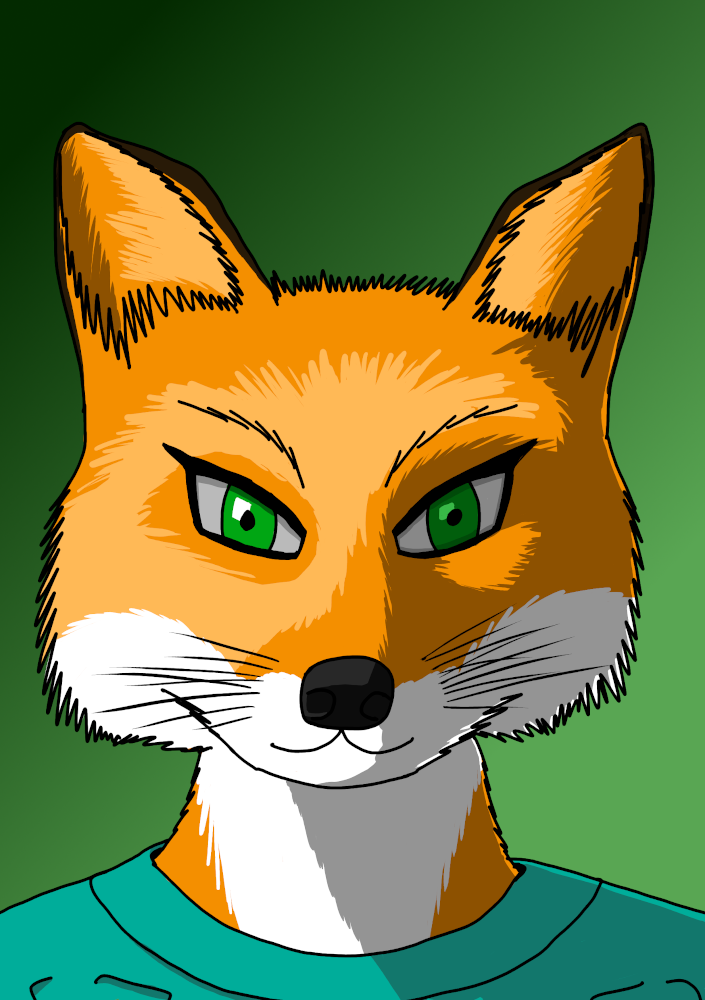

# Aury

* **Rôles** : Technologie, Informatique, Négociation
* **Concept** : une chimère technophile

## Identité

* **Pseudonyme** : Aury
* **Nom administratif** : Aury
* **Pronom** : Elle
* **Type d’esprit** : IA Wolfa
* **Enveloppe** : Chimère cyborg
* **Professions** : Hackeur
* **Affiliations** : Suan, Indépendante

## Description

* **Description physique** : incarnée dans une enveloppe de chimère, vous ressemblez à une renarde anthropomorphe d’environ un mètre trente. Aucune trace de vos implants cybernétique n’est visible de l’extérieur, mais vous possédez bien une console de décryptage intégrée.
* **Possessions** : vous voyagez avec Fran votre robot de transport qui contient aussi votre propre petit laboratoire de fabrication. Vous avez toujours avec vous un contrôleur de foglet et vous aimez vous en servir. Vous possèdez aussi aussi vos propre logiciels de sociabilité et logiciel de maintenance.
* **Avatar** : votre avatar est une version dessinée de votre enveloppe.
* **Tags SolNet** : « Aury », « Elle », « Pas bizarre »

## Comportement

* **Caractère** : vous êtes curieuse, inventive et avenante.
* **Méthodes** : vous préférez résoudre les conflits par la diplomatie et pensez pouvoir tout résoudre avec de l’ingénierie excessive.
* **Objectifs** : vous voulez voir ce que cet univers a dans le ventre, presque littéralement.
* **Motivation** : vous aimez découvrir de nouvelle choses et aider les gens.
* **Opinions** : vous êtes extrêmement positive vis-à-vis de la technologie. Vous n'avez littéralement rien à faire de l'origine des gens, s'ils sont modifiés ou non. Les psions vous intriguent beaucoup. Au niveau de la politique, vous n'avez aucun avis sur la Terre et considèrez que les colonies contiennent autant de bonnes choses que de mauvaises.

## Histoire

* **Date et lieu de naissance** : née à Prettysand en 2222
* **Historique** : à l’origine, vous étiez une IA de recherche, initialisée et employée dans un laboratoire d’ingénieurie de Suan. À votre accession à la sentience, vous avez quitté votre emploi pour découvrir le monde et éprouver votre savoir à l’extérieur des murs de votre maison natale. Vous avez beaucoup voyagé sur Titan et Mimas et avez fini par vous constituer un véritable laboratoire de fabrication ambulant : Fran. Aidant régulièrement d’autres indépendant ou parfois même des instances plus officielles, vous vous êtes plus d’une fois embarquée dans des aventures exaltantes. La plupart de vos collègues apprécient vos qualités de technophile et vous vous êtes même essayée au métier de decker avec un certain succès.

## Éléments

>> (C : carrière, T : trait, P : trait de personnalité, E : équipement, M : modification, L : logiciel, R : relation)

* Technophile (C) : 2
* Decker (C) : 2
* IA de recherche (C) : 2
* IA Wolfa (T) : 1
* Chimère cyborg (T) : 1
* Petite (T) : 1
* Console de décryptage intégrée (M) : 2
* Fran (E) : 2
* Laboratoire de fabrication (E) : 3
* Contrôleur de foglet (E) : 2
* Logiciels de sociabilité (L) : 3
* Logiciel de maintenance (L) : 1
* Curieuse (P) : 1
* Inventive (P) : 1
* Avenante (P) : 1
* Privilégie la diplomatie (P) : 2
* Ingénierie excessive (P) : 3
* Suan (R) : 2
* Titan et Mimas (R) : 1
* Indépendants (R) : 1
