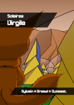

# Récits

Voici plusieurs récits, nouvelles, romans, et même un début de BD, illustrant l'univers de Solaires. D'autres seront évidemment à venir.

>> ### Ordre de lecture
>>
>> Les récits de Solaires ne se suivent pas directement et si des personnages passent de l'un à l'autre, il est possible de les lire dans n'importe quel ordre. Pour autant, certains préféreront les lire dans l'ordre chronologique, d'autres dans l'ordre de lecture. Pour vous aider voici quelques infos.
>>
>> Ordre chronologique (date approximative dans l'univers) :
>> * *Nevi* (novembre 2077) ;
>> * *Idle* (septembre-octobre 2091) ;
>> * *Le puits interdit* (février 2093) ;
>> * *Virgile* (avril 2093) ;
>> * *Émergence* (principalement août 2093) ;
>> * *Les invisibles* (septembre 2093) ;
>> * *Nouveaux dieux* (février 2094).
>> 
>> Ordre d'écriture (date d'écriture) :
>> * *Le puits interdit* (novembre 2014) ;
>> * *Nevi* (décembre 2015) ;
>> * *Idle* (mai 2017) ;
>> * *Nouveaux dieux* (novembre 2017) ;
>> * *Virgile* (août 2018) ;
>> * *Émergence* (novembre 2018).
>> * *Les invisibles* (novembre 2019) ;
>>
>> Dans quel ordre, j'en conseille la lecture ? Je vous propose de commencer par Virgile puis de suivre l'ordre chronologique.

>> Note : ces récits n'ont pas encore été mis à jour pour correspondre à la nouvelle chronologie. Les changements restent toutefois mineurs et ne remettent pas en cause le contenu de ces histoires. Si l'ancienne chronologie plaçait le contexte « contemporain » en 2093, la nouvelle le place en 2237.

## Virgile (Nouvelle)

*De Sylvain "Greewi" Dumazet*

2093, Marineris, capitale de Mars. L'enlèvement du fils d'un diplomate en visite sur Mars conduit un assistant domestique à recruter indirectement une équipe indépendante pour régler sa situation. Ne soyez pas surpris : après tout, si une IA est mise face à un problème, n'est-elle pas amenée à le résoudre ?

Cette nouvelle écrite en 2018 a été conçue dans le but de servir d'introduction à l'univers de Solaires. Bien qu'elle se déroule chronologiquement juste avant le roman Émergence, elle peut être lue indépendamment.

[Lire en ligne](Récits/Virgile)

Fichiers :
* [Format PDF (0.5mo)](Récits/solaires_virgile.pdf)
* [Format EPUB (0.4mo)](Récits/solaires_virgile.epub)
* [Format MOBI (0.3mo)](Récits/solaires_virgile.mobi)

## Nevi (Nouvelle)

*De Sylvain "Greewi" Dumazet*

Depuis les premières IA fortes, le suicide d'un développeur d'IA n'est plus anodin : il restera toujours le doute : est-ce que quelque chose se promène dans les coins sombres du réseau ?

Voilà pourquoi, malgré la fermeture de l'enquête par les autorités locales, l'ONU déploie deux agents faire le jour sur l'affaire. Et espérons que les travaux de la victime ne soient pas la cause de ce décès prématuré.

Cette nouvelle a été écrit en décembre 2015. À l'origine, elle devait faire partie d'un ensemble plus grand de textes présentant l'histoire de divers personnages de l'univers de Solaires. Le projet a finalement été annulé, mais ce texte conserve ce caractère singulier que je souhaite partager.

[Lire en ligne](Récits/Nevi)

Fichiers : 
* [Format PDF (0.3mo)](Récits/solaires_nevi.pdf)
* [Format EPUB 10.3mo)](Récits/solaires_nevi.epub)
* [Format MOBI (0.1mo)](Récits/solaires_nevi.mobi)

## Idle (Nouvelle)

*De Sylvain "Greewi" Dumazet*

Fillette des colonies, Myla n'a que six ans quand ses parents décident de lui offrir un nevian, un vrai ! Cette peluche intelligente est destinée à prendre soin d'elle et même à devenir son meilleur ami. Mais ce nouvel arrivant pourrait bien chambouler les habitudes de ses parents terriens, si le rythme de vie des colonies ne le fait pas avant…

Cette nouvelle a été écrite en mai 2017. Bien qu’indépendante, elle s’inscrit dans l’univers de Solaires, aux côtés de Nevi et Le Puits Interdit. Si le texte a été écrit sur deux semaines, l’intrigue et plus particulièrement les nevians ont occupés (et occupent toujours) mon esprit pendant plus de deux ans.

[Lire en ligne](Récits/Idle)

Fichiers : 
* [Format PDF (0.2mo)](Récits/solaires_idle.pdf)
* [Format EPUB (0.3mo)](Récits/solaires_idle.epub)
* [Format MOBI (0.3mo)](Récits/solaires_idle.mobi)

## Le puits interdit (Roman)

*De Sylvain "Greewi" Dumazet*

Verner, diplomate terrien, retrouve enfin sa femme sur Mars, dans les colonies. Mais sans son fils resté sur Terre. Pour retrouver ce dernier, les puissantes corporations envoient alors Tsadir, une cyborg, en direction de la Terre. Évidemment, elle se doute déjà qu'il ne s'agit pas d'une simple mission de baby-sitting et l'agent des colonies découvrira bien assez vite que l'humanité n'a pas pas perdu ses mauvaises habitudes...

Ce roman a été écrit lors du NaNoWriMo 2014 et fut le premier roman dans l'univers de Solaires.

Fichiers : 
* [Format PDF (1.3mo, v0.3)](Récits/solaires_le_puits_interdit.pdf)
* [Format EPUB (1.2mo, v0.3)](Récits/solaires_le_puits_interdit.epub)
* [Format MOBI (0.8mo, v0.3)](Récits/solaires_le_puits_interdit.mobi)

## Émergence (Roman)

*De Sylvain "Greewi" Dumazet*

« L’émergence est le principe qui fait que certaines choses possèdent des propriétés qui ne peuvent pas être directement devinées en observant ses constituants. Par exemple, la vie est une propriété émergente qui découle pourtant de “simples” réactions chimiques. »

L’établissement de l’humanité, et ses enfants, dans le système solaire relativise toujours plus la place de la Terre. Prise dans les engrenages de la dernière grande corporation terrienne, une jeune femme se confronte à la collision d’une humanité dépassée avec ces colonies nouvelles.

Fruit de ma participation au NaNoWriMo 2018, ce roman poursuit l’exploration de l’univers de Solaires. Profitant de ce concours qui consiste à écrire un roman de 50 000 mots en un mois – du premier au trente novembre – sa rédaction m’a permis de développer de nouveaux aspects de ce projet.
Je remercie au passage mes lecteurs qui ont enduré ma plume lors du concours, ainsi que mes relecteurs Morvan et Titi.
Si chronologiquement, Émergence se situe entre les romans Le puits interdit et Nouveaux dieux, il peut se lire indépendamment.

Fichiers : 
* [Format PDF (1.2mo, v1.0)](Récits/solaires_emergence.pdf)
* [Format EPUB (0.5mo, v1.0)](Récits/solaires_emergence.epub)
* [Format MOBI (0.5mo, v1.0)](Récits/solaires_emergence.mobi)

## Les invisibles (Roman)

*De Sylvain "Greewi" Dumazet*

Livré à la mauvaise personne, ou plus exactement volé, un assistant domestique se retrouve entre les mains de la mafia martienne. Promis à un funeste destin, il se montrera d’une nature bien trop imprévisible pour assurer ce genre de prophétie et tracera sa propre route. De leur côté, deux agents des renseignements de la planète rouge s’intéressent à une nouvelle venue qui, bien qu’apparemment innocente, pourrait contribuer à une invisible révolution et malgré tout réaliser quelques rêves.

Ce roman est issu de ma participation au NaNoWriMo 2019, un concours d’écriture qui consiste à écrire un roman de 50 000 mots en un mois, du 1er novembre au 30. Il ne s’agit pas d’une compétition et gagnent tous ceux qui ont atteint le nombre de mots fatidiques. Il s’agit de mon quatrième roman et sans doute du plus important jusqu’ici.

Chronologiquement, il fait suite au roman Émergence et peut comporter quelques divulgâchages mineurs. Il n’est pas nécessaire en revanche d’avoir lu celui-ci pour profiter du présent texte.

Fichiers : 
* [Format PDF (2.1mo, v1.0)](Récits/solaires_les_invisibles.pdf)
* [Format EPUB (1.3mo, v1.0)](Récits/solaires_les_invisibles.epub)
* [Format MOBI (1.0mo, v1.0)](Récits/solaires_les_invisibles.mobi)

## Nouveaux dieux (Roman)

*De Sylvain "Greewi" Dumazet*

« Donnez à une IA forte un constructeur universel, et vous aurez créé un nouveau dieu. »

Ce dicton bien naïf est malgré tout un mème récurrent dans la société des Solaires. Nous sommes en 94… 2094. La technologie n'a plus de repères comparables avec celle du début du siècle : ces fameux constructeurs universels ne sont plus des éléments de fiction et les intelligences artificielles imprègnent la société extra-terrestre à tout niveau. La mort a été vaincue, plusieurs planètes et lunes ont été colonisées et de nouveaux êtres sont même nés.

Et pourtant, rien de véritablement semblable à ces hypothétiques nouveaux dieux.

Écrite pendant le NaNoWriMo 2017, cette histoire fait suite à Solaires – Le puits interdit, Solaires – Nevi et Solaires – Idle. Le lecteur pourra souhaiter les lire avant mais sans nécessité : cette histoire n'est pas une suite directe.

Fichiers : 
* [Format PDF (2.8mo, v1.0)](Récits/solaires_nouveaux_dieux.pdf)
* [Format EPUB (0.7mo, v1.0)](Récits/solaires_nouveaux_dieux.epub)
* [Format MOBI (0.7mo, v1.0)](Récits/solaires_nouveaux_dieux.mobi)
