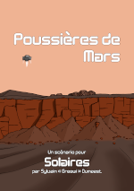
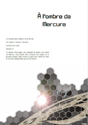
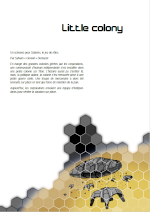
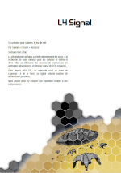
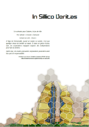

# Scénarios

Voici une collection de scénarios pour *Solaires*. Ces scénarios vous proposent des aventures et des enquêtes pour la plupart indépendantes les unes des autres. Toutefois, les thèmes ou le contexte de certains sont plus adaptés à certaines équipes de personnage et peuvent s'intégrer, ou non, dans une campagne. Vous trouverez quelques précision pour chacun de ces scénarios.

>> ### Avertissement
>> 
>> Cette section contient du matériel destiné avant tout aux meneurs. Si vous ne comptez pas endosser ce rôle, ces documents sont susceptibles d'être une source de divulgâchage.

>> Note : ces scénarios n'ont pas encore été mis à jour pour correspondre à la nouvelle chronologie. Les changements restent toutefois mineurs et ne remettent pas en cause leur contenu. Si l'ancienne chronologie plaçait le contexte « contemporain » en 2093, la nouvelle le place en 2237.

## Poussières de Mars

*De Sylvain "Greewi" Dumazet*

Un groupe de touristes parti visiter une installation martienne isolée ne donne plus de signe de vie. Les forces de sécurité de Mars envoient une équipe pour les retrouver et les ramener sains et saufs dans les colonies.

Ce scénario est particulièrement adapté pour l'*Équipe MSF-2* décrite le livre *Les personnages*. Il s'intègre aisément au sein d'une campagne mettant en scène cette même équipe.

Thèmes : exploration, enquête, situation de crise.

Fichiers : 
* [Format PDF (3.2mo)](Scénarios/poussières_de_mars.pdf)
* [Carte de la mesa](Scénarios/poussières_de_mars_carte_mesa.png)

## À l'ombre de Mercure

*De Sylvain "Greewi" Dumazet*

En attente d’être jugée, une criminelle de guerre s’est enfuie sur Mercure. Aesir décide donc d’envoyer une équipe sur la première planète. Mais comme il s’agit d’une colonie de Sol6, ce sont des indépendants qui ont été choisis.

Ce scénario est plus adapté à des groupes d'indépendants travaillant pour les corporations ou un groupe des Solar Wardners. Il peut être intégré dans la plupart des campagnes.

Thèmes : diplomatie, infiltration/combat, choix éthique majeur.

Fichiers : 
* [Format PDF (1.7mo)](Scénarios/a_l_ombre_de_mercure.pdf)
* [Carte de Kandinsky](Scénarios/a_l_ombre_de_mercure_carte_kandinsky.png)

## Little colony

*De Sylvain "Greewi" Dumazet*

En marge des grandes colonies gérées par les corporations, une communauté d'humain indépendante s'est installée dans une petite colonie sur Titan. L'histoire aurait pu s'arrêter là, mais, la politique aidant, la colonie s'est retrouvée prise à une petite guerre civile. Une troupe de mercenaire a alors été envoyée sur place en tant que force de maintien de la paix.

Aujourd'hui, les corporations envoient une équipe d'indépendants pour vérifier la situation sur place.

Ce scénario est particulièrement adapté pour un groupe d'indépendant travaillant pour les corporations ou un groupe des Solar Wardners. Il peut être intégré dans la plupart des campagnes.

Thèmes : diplomatie, conflit, situation de crise.

Fichiers : 
* [Format PDF (1.4mo)](Scénarios/little_colony.pdf)
* [Carte de Nostradoma](Scénarios/little_colony_carte_nostradoma.png)

## L4 Signal

*De Sylvain "Greewi" Dumazet*

La sécurité civile de Mars surveille attentivement les cieux, à la recherche de toute menace pour les colonies et même la Terre. Mais en effectuant des mesures de routines sur les astéroïdes géocroiseurs, un étrange signal de SOS est perçu. Émis depuis 2010-TK 7 , un astéroïde situé au point de Lagrange L4 de la Terre, ce signal colonial soulève de nombreuses questions.

Mars décide donc d'y envoyer une expédition confiée à des indépendants.

Ce scénario est adapté aux groupes adaptés à la survie et le sauvetage spatial. Il peut être intégré dans toute campagne mettant en scène de tels groupes.

Thèmes : survie, situation de crise.

Fichiers : 
* [Format PDF (0.4mo)](Scénarios/l4_signal.pdf)

## In Sillico Veritas

*De Sylvain "Greewi" Dumazet*

À l'âge de l’immortalité, quand un solaire se suicide, c'est que quelque chose de terrible se trame. Et dans ce genre d’occasion, les corporations engagent toujours des indépendants pour faire la lumière.

Après tout, ces toutes puissantes corporations pourraient avoir leur part de responsabilité.

Ce scénario est particulièrement adapté à l'équipe MSF-2 ou à un groupe des Solar Wardners. Nous déconseillons de l'intégrer dans une campagne, surtout pour en faire le final (c'est une vraie mauvaise idée).

Thèmes : enquête, combat, vertige existentiel, choix éthique majeur.

Fichiers : 
* [Format PDF (1.5mo)](Scénarios/in_sillico_veritas.pdf)
* [Plan du dôme de Mnemesics](Scénarios/in_sillico_veritas_carte_mnemesics.png)
* [Plan de la station Chamak](Scénarios/in_sillico_veritas_carte_chamak.png)
