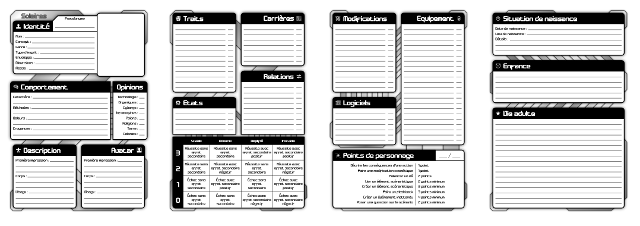

# Fiches de personnages

Voici les différentes fiches de personnages pour Solaires. Nous y avons conservé les fiches depuis la version 3 des règles du jeu mais nous vous conseillons très fortement la première présentée dans cette page.

## Solaires V5 (v13)

Fiche de personnage pour Système Féerie V5 (version 13, 4 pages A5) :
* [Fiche de base](Fiches/fichev5basev13.pdf) (Conseillée)

*Attention : ces fiches sont au format A5. Pensez à les imprimer en mode 2 page par feuille ou mieux en mode livret ("Booklet").*

## Solaires V5 (Anciennes)

Fiche composées pour Système Féerie V5 :
* [Fiche de base (Fiche civile + Persona)](Fiches/fichev5base.pdf) (2.3Mo)

* [Fiche d'enveloppe](Fiches/fichev5enveloppe.pdf) (1.3Mo)

* [Fiche de persona](Fiches/fichev5personna.pdf) (2.8Mo)

* [Fiche de personnage](Fiches/fichev5simple.pdf) (2.3Mo) - Fiche simplifiée en deux A5

*Note : la version composée des fiches de personnage de Solaires comporte plusieurs feuilles thématiques. Si tous les personnages ont besoin de la fiche de base, beaucoup ont besoin de la fiche d'enveloppe et quelques uns peuvent avoir besoin de fiches de persona supplémentaire. Une fiche simplifiée regroupant tout est disponible, mais elle guide beaucoup moins la création du personnage.*

*Attention : ces fiches sont au format A5, pensez à les imprimer en mode 2 page par feuille.*

## Solaires V3

Fiche de personnage pour Système Féerie V3 :
* [Fiche de personnage](Fiches/fiche_perso.pdf)(100ko)
