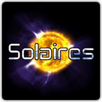
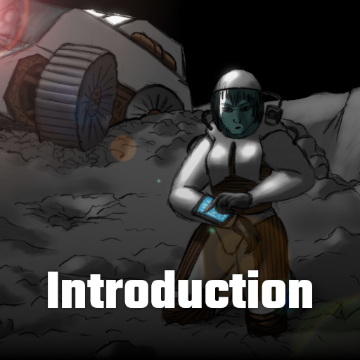
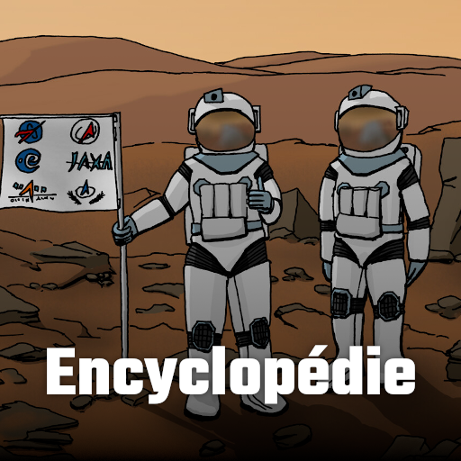
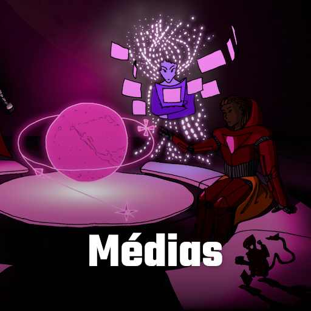
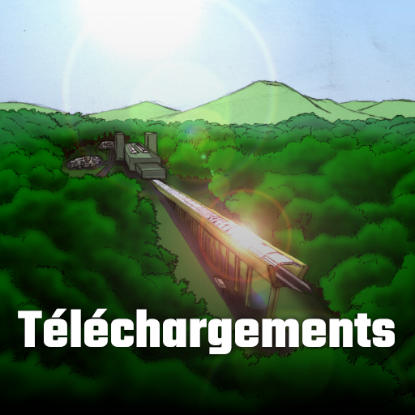
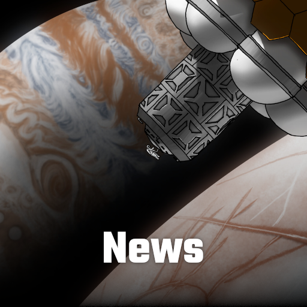
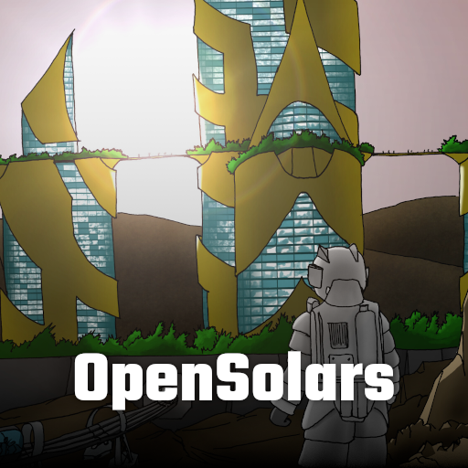
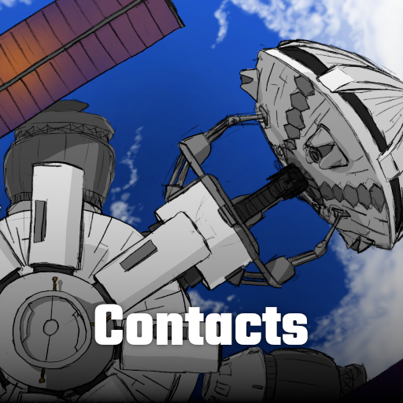

# Solaires

Bienvenue sur le site de Solaires, un jeu de rôles de science fiction dont les thèmes explorent le transhumanisme, la colonisation spatiale, l'héroïsme, le progrès technologique et même le paradoxe de Fermi.

Incarnez les Solaires, les enfants de l’humanité, dans un futur technologique où même la mort a rendu sa faux. Prenez part aux intrigues des colonies, véritables cités bâties par les puissantes corporations sur Mercure, Mars et même les lunes de Jupiter et Saturne.

Avec le pouvoir de l’intelligence artificielle, de la fusion nucléaire et des constructeurs universels, contemplez l’univers tels de nouveaux dieux. Et qui sait ? Peut-être parviendrez-vous à vous réconcilier avec ces parents qui vous ont rejetés et vivent reclus sur cette petite planète bleue ?

Mais que vous soyez cyborg, cybernétique, réplicant, chimère, éthéré ou même une IA, n’oubliez jamais que votre si précieuse technologie peut tout aussi bien se retourner contre vous.

>> Sauf mention contraire, le contenu de ce site est distribué sous une licence : [CC Attribution-Noncommercial-Share Alike 4.0 International](http://creativecommons.org/licenses/by-nc-sa/4.0/).
>>
>> Les images de fond de certaines sections ont été générées avec Space Engine.
>>
>> Le contenu a été élaboré grace aux logiciels suivants : [LibreOffice](https://fr.libreoffice.org/), [Grammalecte](https://www.dicollecte.org/grammalecte/), [Freeplane](https://www.freeplane.org), [GIMP](https://www.gimp.org/fr/), [Inkscape](https://inkscape.org/fr/), [Calibre](https://calibre-ebook.com/), ainsi que de nombreux outils de GNU/Linux.
